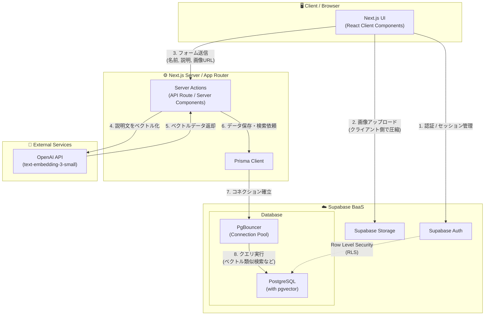

# 創作モンスター図鑑　🏆✨

ユーザーが作成したオリジナルの「モンスター」を共有し、閲覧・検索できる画像投稿型のSNSアプリケーションです。Next.js (App Router)、Supabase、Prismaを使用して構築されており、OpenAIのベクトルエンベディングを用いた類似検索機能も備えています。

<p align="center">
  
</p>

<p align="center">
  
  
  
  
  
  
</p>

## Live Web App: https://monster-zukan.vercel.app/

## 🚀機能一覧

- **ユーザー認証**: Supabase Authによる安全なログイン/サインアップ機能
- **投稿機能**: 属性(炎・水など)やレアリティ、画像と説明文を組み合わせたモンスターの登録
- **画像管理**: 画像投稿時に自動圧縮・リサイズを行い、Supabase Storageへアップロード
- **インタラクション**:
  - 各モンスターへの「いいね」機能
  - 投稿に対する「コメント」機能
- **ベクトル検索 (AI検索)**: OpenAIのEmbedding APIを用いた、自然言語による類似モンスター検索機能
- **無限スクロール**: ページネーションではなく、スクロールでシームレスに一覧表示するUI
- **レスポンシブデザイン**: Tailwind CSSによるモバイル・PC両対応のレイアウト

## 🧰 技術スタック

### フロントエンド

- **フレームワーク**: Next.js 16 (App Router)
- **UIライブラリ**: React 19
- **スタイリング**: Tailwind CSS 4, Tailwind Merge
- **アイコン**: Lucide React
- **その他**: React Hot Toast (通知), browser-image-compression (画像圧縮)

### バックエンド / データベース

- **BaaS**: Supabase (Auth, Storage, PostgreSQL)
- **ORM**: Prisma (PgBouncer対応)
- **AI / 検索**: OpenAI API (text-embedding-3-small)

## 🏗️アーキテクチャ



## 🧠 工夫した点と苦労した点

本プロジェクトでは、特に以下の技術的な課題解決とバックエンド処理の最適化に注力しました。

### 1. 自然言語による「曖昧検索」の実現とパフォーマンス最適化

- **課題**: 従来のキーワード一致検索では、「ぷにぷにしている」「いつも寝ている」といったモンスターの特徴に対するユーザーの抽象的な検索意図を汲み取ることができませんでした。
- **解決策**: OpenAIの `text-embedding-3-small` モデルを採用し、モンスター登録時に説明文をベクトル化して Supabase (PostgreSQL) に保存する仕組みを構築しました。検索時は、ユーザーの入力テキストも同様にベクトル化し、`pgvector` 拡張機能を用いてコサイン類似度を計算することで検索結果を返しています。
- **結果**: 単なる単語の羅列だけでなく、文脈やニュアンスを理解した検索が可能になり、図鑑アプリとしてのUXが大幅に向上しました。また、Prismaから生のSQLクエリを発行して類似度計算を最適化し、検索レスポンスの遅延も最小限に抑えています。

### 2. クライアントサイドでの画像圧縮によるストレージ最適化

- **課題**: ユーザーがスマートフォン等で撮影した高解像度の画像をそのままアップロードすると、Supabase Storageの容量を圧迫し、ネットワーク帯域の消費や一覧画面の読み込み速度低下に繋がる懸念がありました。
- **解決策**: 画像をサーバーに送信する前に、フロントエンド側で `browser-image-compression` を用いてリサイズおよびファイルサイズの圧縮処理を挟むフローを実装しました。
- **結果**: 画質を損なうことなくファイルサイズを大幅に削減でき、ストレージコストの節約と画像読み込み速度の向上を両立できました。

### 3. ゼロからのフルスタック開発とアーキテクチャ設計への挑戦

- **課題**: これまで部分的な技術の学習はしていましたが、フロントエンド (Next.js) からデータベース (Supabase/Prisma)、さらには外部API (OpenAI) までを連携させた、この規模のWebアプリケーションをゼロから自分一人で設計・構築するのは初めての経験でした。開発初期は「ビジネスロジックをどこに配置すべきか」「状態管理やデータの受け渡しをどう最適化するか」など、各技術の統合と全体像の把握に非常に苦労しました。
- **解決策**: 行き当たりばったりで実装するのではなく、公式ドキュメントを読み込み、Next.js App Routerの設計思想や、クライアントとサーバー間の境界線（Server Actionsの適切な用法など）を体系的に理解するよう努めました。また、機能ごとにコンポーネントやデータアクセス処理を分割し、将来的な拡張や保守性を意識したディレクトリ構成を心がけました。
- **結果**: 数え切れないほどのエラーに直面しながらも、一つ一つ原因を特定して解決することで、単なるツールの寄せ集めではなく「システム全体でデータがどう流れ、どう処理されているか」という解像度が劇的に上がりました。この経験を通じて、表側のUIだけでなく、目に見えないデータの流れやシステムを支えるバックエンド領域の重要性と、全体を俯瞰する設計思考を養うことができました。

## 🚀 クイックスタート

### 前提条件

- Node.js 18.x以上
- npm または yarn
- Supabase アカウント (PostgreSQL, Storage, Auth)
- OpenAI API キー (ベクトル検索用)

### セットアップ手順

#### 1. リポジトリのクローン

```bash
git clone https://github.com/t-toshiro/monster-zukan.git
cd monster-zukan
```

#### 2. パッケージのインストール

```bash
npm install
```

#### 3. 環境変数の設定

`.env.example` などの内容を参考に、プロジェクト直下に `.env.local` ファイルを作成し、必要な環境変数を設定します。

```env
# Supabase
NEXT_PUBLIC_SUPABASE_URL=your_supabase_url
NEXT_PUBLIC_SUPABASE_ANON_KEY=your_supabase_anon_key

# Database
DATABASE_URL=your_database_connection_string
DIRECT_URL=your_database_direct_connection_string

# OpenAI
OPENAI_API_KEY=your_openai_api_key
```

#### 4. データベースのセットアップ

Prismaを使用してデータベーススキーマを反映させ、クライアントを生成します。

```bash
npm run prisma db push
npm run prisma generate
```

#### 5. 開発サーバーの起動

```bash
npm run dev
```

サーバーが起動したら、ブラウザで `http://localhost:3000` にアクセスしてください。

## 📁 プロジェクト構成

```
monster-zukan/
├── app/                  # Next.js App Router (各ページ、コンポーネント、Server Actions)
│   ├── actions/          # サーバーサイド処理 (DB操作, API呼び出しなど)
│   ├── components/       # 再利用可能なUIコンポーネント
│   └── (その他各ルート)
├── lib/                  # 共通ユーティリティ (Prisma Client初期化など)
├── prisma/               # Prisma Schemaとマイグレーションファイル
├── utils/                # 外部サービスの設定 (Supabase Clientなど)
└── public/               # 静的ファイル
```

## 📝 ライセンス

このプロジェクトは学習用・ポートフォリオ用のプロジェクトです。ご自身のプロジェクトの参考として自由にご活用ください。

---

**Built with ❤️ using Next.js, Supabase, Prisma, and OpenAI**
